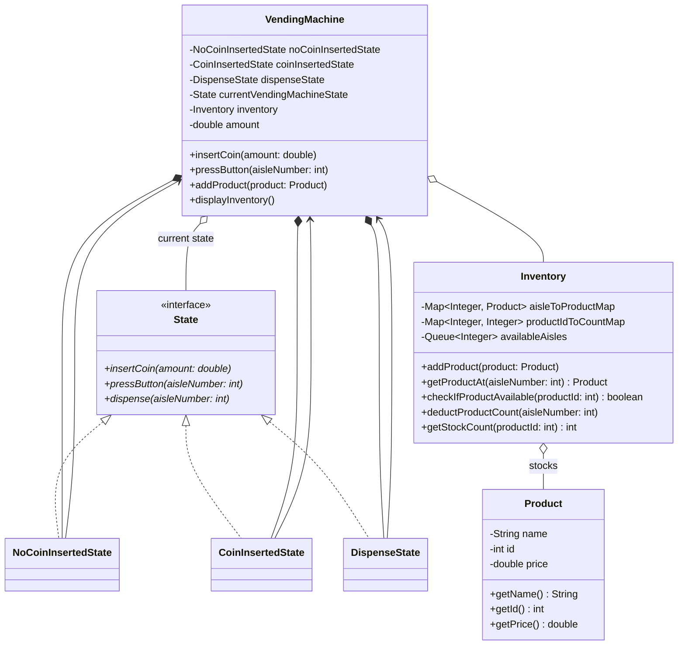

# Vending Machine UML

```mermaid
classDiagram
    class VendingMachine {
        -NoCoinInsertedState noCoinInsertedState
        -CoinInsertedState coinInsertedState
        -DispenseState dispenseState
        -State currentVendingMachineState
        -Inventory inventory
        -double amount
        +insertCoin(amount: double)
        +pressButton(aisleNumber: int)
        +addProduct(product: Product)
        +displayInventory()
    }

    class State {
        <<interface>>
        +insertCoin(amount: double)*
        +pressButton(aisleNumber: int)*
        +dispense(aisleNumber: int)*
    }
    class NoCoinInsertedState
    class CoinInsertedState
    class DispenseState


    class Inventory {
        -Map~Integer, Product~ aisleToProductMap
        -Map~Integer, Integer~ productIdToCountMap
        -Queue~Integer~ availableAisles
        +addProduct(product: Product)
        +getProductAt(aisleNumber: int) Product
        +checkIfProductAvailable(productId: int) boolean
        +deductProductCount(aisleNumber: int)
        +getStockCount(productId: int) int
    }
    class Product {
        -String name
        -int id
        -double price
        +getName() String
        +getId() int
        +getPrice() double
    }

    State <|.. NoCoinInsertedState
    State <|.. CoinInsertedState
    State <|.. DispenseState
    VendingMachine *-- NoCoinInsertedState
    VendingMachine *-- CoinInsertedState
    VendingMachine *-- DispenseState
    VendingMachine o-- State : current state
    VendingMachine o-- Inventory
    Inventory o-- Product : stocks
    NoCoinInsertedState --> VendingMachine
    CoinInsertedState --> VendingMachine
    DispenseState --> VendingMachine
```
